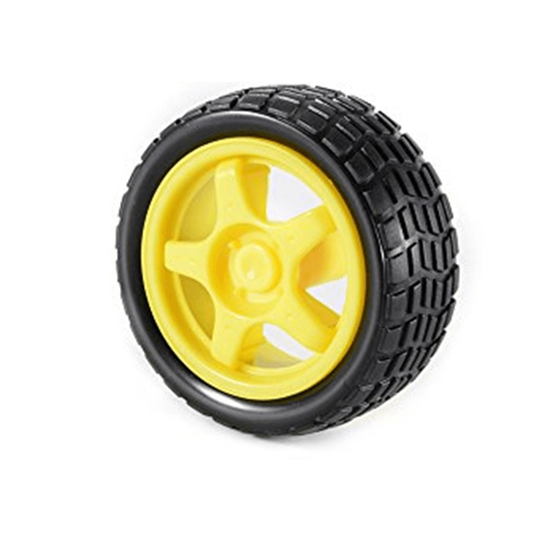
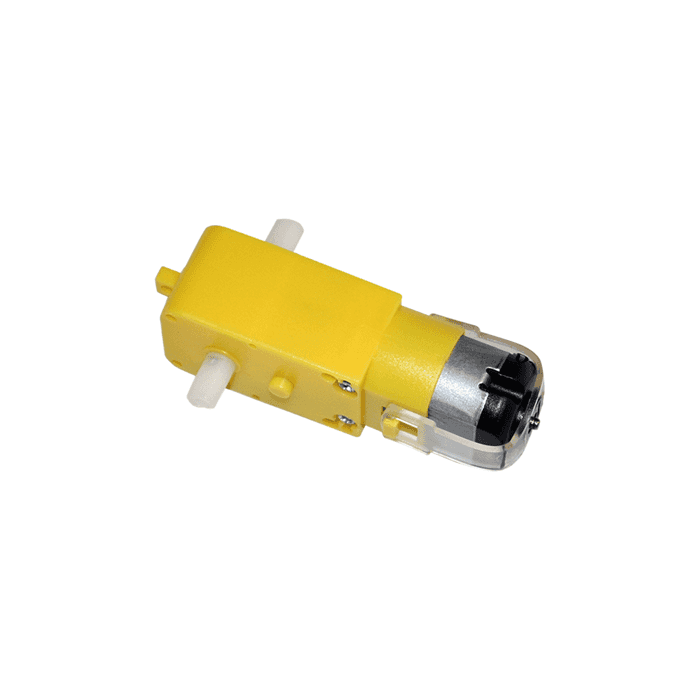

# 🏎️ **Proyecto: Auto Futbol**

Este proyecto consiste en la construcción de un **robot futbolista** controlado a distancia, diseñado para participar en competencias de robótica, basado en las normas de la **Liga Nacional de Robótica**.

---

## 🎯 **Materiales que formarán parte del robot**:

### 🛠 **Componentes Principales**:
- **2 Ruedas Amarillas** compatibles con motorreductor.

- **2 Motores DC - Motorreductor 2 Ejes** para el movimiento.

- **1 Doble Puente H** para el control de los motores.
- 
- **1 Placa Arduino Uno** para el control del robot.
 
- **1 Módulo Bluetooth** para la comunicación con el mando.
  
- **Cables (Macho-Macho, Macho-Hembra)** para las conexiones.
  
- **1 Rueda Loca** para mejorar la estabilidad.
  
- **1 Interruptor** para activar el sistema.
- **1 Porta Baterías** para almacenar las baterías.  
- **Baterías Recargables** para la alimentación.
- **Chasis (Material a elección)**: El cuerpo del robot.
- **Tornillos** para el ensamblaje.

---

### 🔧 **Materiales de Trabajo**:
- **Silicona** para fijaciones y sellado.
- **Estaño** para la soldadura.
- **Soldador de Estaño** para realizar las conexiones electrónicas.
- **Voltímetro** para verificar las conexiones eléctricas.
- **Alicate** para cortar y manipular cables.
- **Destornillador** para ensamblar las partes.

---

## ⚙️ **Especificaciones del Robot** (Basadas en la Liga Nacional de Robótica):

1. **Dimensiones**:
   - Las dimensiones máximas son **20 cm x 15 cm** (sin límite de altura).
   - Las medidas pueden ser **ancho x largo (20x15 cm)** o **largo x ancho (15x20 cm)**.

2. **Ruedas**:
   - El robot puede tener **dos o más ruedas** para el desplazamiento.

3. **Peso**:
   - El peso máximo permitido es de **1 kg**.

4. **Control**:
   - El robot debe ser **radiocontrolado**, es decir, **comandado a distancia**.
   - Se puede usar cualquier tipo de **comunicación** entre el mando y el robot.

5. **Frecuencia y Modulación**:
   - No hay garantía de que los **canales y frecuencias** de comunicación estén libres.
   - Se puede usar cualquier tipo de **modulación de frecuencia** para el control del robot.

6. **Indicadores**:
   - El robot deberá contar con un **LED indicador** que muestre que el robot está activado.

7. **Piezas**:
   - No está permitido que el robot **despliegue piezas** una vez iniciado el encuentro.
   - El robot **no se debe separar** en distintas piezas durante la competencia.

8. **Componentes Electrónicos**:
   - Se puede usar cualquier tipo de **elemento electrónico básico** (compuertas, transistores, operacionales, etc.), y también **microcontroladores** y **microprocesadores**.

9. **Motriz**:
   - Los únicos elementos permitidos para la parte motriz son los **motores eléctricos o motorreductores**.

10. **Alimentación**:
    - La **alimentación** de los motores será proporcionada por **baterías**.

---

## 🚀 **¡A jugar al fútbol con robótica!**

Este robot está diseñado para ser **rápido, eficiente y fácil de controlar**. Con una base sólida en Arduino y un módulo Bluetooth para el mando, promete ofrecer una experiencia divertida y desafiante en el campo de fútbol robotizado.

¡A trabajar en los detalles y que comience el desafío!

---

### 📸 **Ejemplo de conexión:**

_(Aquí puedes agregar imágenes o diagramas de cómo conectar los componentes, o un diagrama de flujo de cómo funciona el sistema. Usa imágenes externas con Markdown si las tienes subidas a algún repositorio o servidor)_

```markdown


